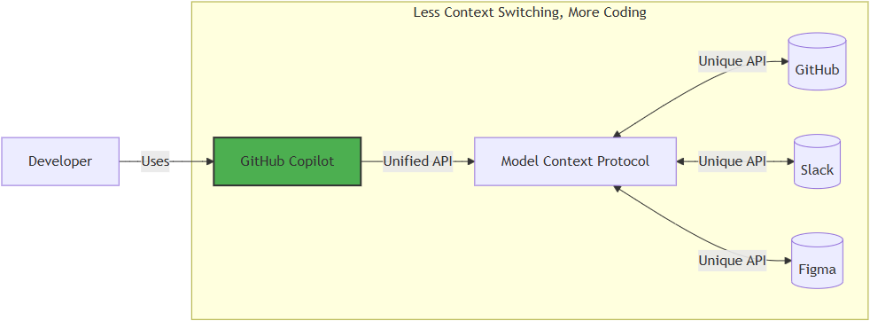
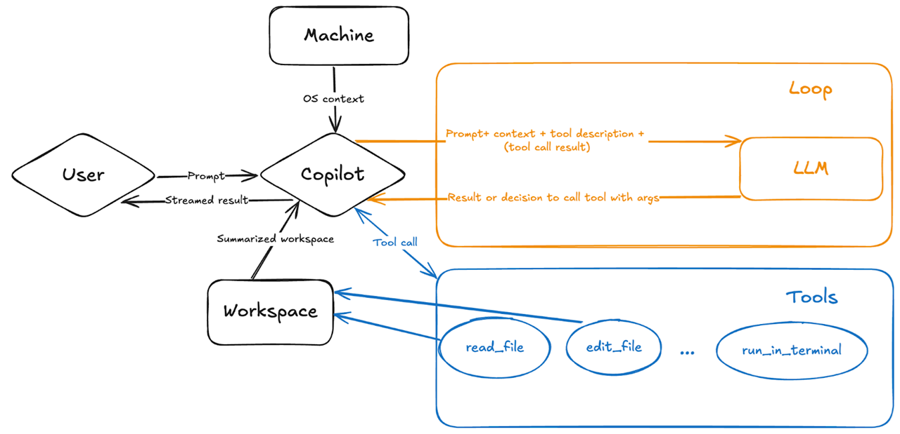

---
post_title: Integrate MCP with Copilot
author: Burak Unuvar
post_slug: integrate-mcp-with-copilot
microsoft_alias: buraknvar
featured_image: ../images/integrate-mcp-with-copilot.png
categories:
  - Tutorials
  - Copilot in IDE
tags:
  - GitHub Copilot
  - MCP
  - Agent mode
  - Tool calling
ai_note: Draft refined with AI assistance.
summary: AI tools need a standard way to act on your behalf, not just reply.
  By adopting Model Context Protocol, GitHub Copilot's agent mode discovers tools,
  selects the right one, and executes it — giving you an AI that operates,
  not only answers.
post_date: 2026-04-04
---

## What Is Model Context Protocol?

Model Context Protocol, or MCP, is often described as "USB-C for AI." That
comparison works because MCP gives AI tools a standard way to connect to
external systems.

Instead of hard-coding one integration at a time, an MCP server exposes its
capabilities in a structured format. That includes what tools are available,
what each tool does, and what input schema each tool expects. A client such as
GitHub Copilot can then inspect that catalog and decide how to use it.

In practical terms, MCP helps Copilot move beyond plain text generation. It
lets the model discover tools, understand their parameters, and call them with
much less guesswork.

## Why MCP Matters in Copilot

When MCP is available, Copilot is not limited to only reading your prompt and
replying with prose. It can reason over the tools exposed by the MCP server and
decide whether a tool call is useful for the task.

At a high level, Copilot evaluates three things:

- Does this request require a tool at all?
- Which tool best matches the user's intent?
- Which arguments should be passed based on the tool's schema?

Once a tool is selected, Copilot can execute it, inspect the result, and use
that output to continue the workflow. That makes the interaction feel much more
agentic: the model is no longer just answering, it is operating.

## How MCP Tool Calling Works in Agent Mode

In agent mode, the loop is typically straightforward:

1. You ask Copilot to do something in natural language.
2. Copilot checks the available tools and their schemas.
3. It selects the tool or tools that best fit the request.
4. It fills in the required arguments and executes the call.
5. It reads the tool result and decides whether to answer, continue, or call
	 another tool.

That tool-aware loop is the core reason MCP feels powerful. The model is not
just generating text about an action. It can actually perform the action when a
matching tool exists.

## What You Can Do With It

With the right MCP server behind it, Copilot can do far more than edit files in
your repository. Depending on the tools that are exposed, you can ask it to:

- Discover similar public repositories for inspiration.
- Search issues using rich context such as titles, descriptions, comments, or
	reactions.
- Turn promising ideas into GitHub issues before they get lost.
- Retrieve an issue, make changes on a branch, and open a pull request.

That is the real value of MCP: it connects natural-language intent to concrete,
structured actions.

## Getting Started

The easiest way to try this is through the remote GitHub MCP Server, which is
hosted by GitHub and requires no local setup. In VS Code 1.101 or later, open
the Copilot Chat panel, toggle Agent mode, and add the server using the one-click
install from the [GitHub MCP Server repository](https://github.com/github/github-mcp-server).
Once connected, the tools are immediately available in your agent sessions.

If you prefer a guided walkthrough, the
[GitHub Skills: Integrate MCP with Copilot](https://github.com/skills/integrate-mcp-with-copilot/)
exercise takes you through the full flow — from setup to opening a pull request —
in under an hour.

## A Small Prompting Tip

In VS Code agent mode, you can type `#tools` in the chat input to see the full
list of tools available from your connected MCP servers. Selecting a tool from
that list gives Copilot a direct hint about which capability to use.

That does not replace MCP. It simply makes tool discovery more explicit when you
know exactly what you want Copilot to do.

## Summary

- **Why:** MCP makes Copilot more useful by helping it act, not just answer.
- **How:** Copilot reads the tool schema, chooses the right tool, passes the required inputs, and uses the result to continue the task.
- **What:** It is a standard way for tools and services to expose their capabilities to AI.

## References

- [GitHub Skills: Integrate MCP with Copilot](https://github.com/skills/integrate-mcp-with-copilot/)
- [GitHub MCP Server](https://github.com/github/github-mcp-server)

<!-- Turn this draft into a publish-ready HTML post consistent with the rest of the site. -->